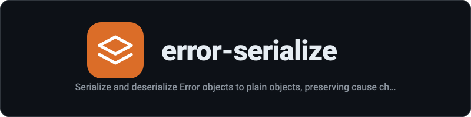

<div align="center">
  
</div>

<p align="center"><strong>Serialize and deserialize Error objects to plain objects, preserving cause chains</strong></p>

<p align="center">
  <a href="https://github.com/mstuart/error-serialize/actions/workflows/main.yml"></a>
  <a href="LICENSE"></a>
  <a href="https://www.npmjs.com/package/error-serialize"></a>
  <a href="https://deepwiki.com/mstuart/error-serialize"></a>
  <a href="https://socket.dev/npm/package/error-serialize"></a>
  
</p>

---
## Install

```sh
npm install error-serialize
```

## Usage

```js
import {serialize, deserialize} from 'error-serialize';

const error = new TypeError('Invalid input');
error.code = 'ERR_INVALID';

const serialized = serialize(error);
//=> {name: 'TypeError', message: 'Invalid input', stack: '...', code: 'ERR_INVALID'}

const json = JSON.stringify(serialized);

const deserialized = deserialize(JSON.parse(json));
deserialized instanceof TypeError;
//=> true
```

### Cause chains

```js
import {serialize, deserialize} from 'error-serialize';

const cause = new RangeError('Value out of range');
const error = new Error('Operation failed', {cause});

const serialized = serialize(error);
serialized.cause.name;
//=> 'RangeError'

const restored = deserialize(serialized);
restored.cause instanceof RangeError;
//=> true
```

## API

### serialize(error)

Returns a plain `object` with `name`, `message`, `stack`, and any custom enumerable properties. Recursively serializes `error.cause`. Non-Error values are returned as-is.

#### error

Type: `Error`

The Error object to serialize.

### deserialize(object)

Returns an `Error` instance reconstructed from the plain object. Maps `name` to built-in error constructors (`TypeError`, `RangeError`, etc.). Recursively deserializes cause chains. Non-error objects are returned as-is.

#### object

Type: `object`

The plain object to deserialize.

## Related

- [graphql-hash](https://github.com/mstuart/graphql-hash) - Generate a deterministic hash of a GraphQL query

## License

MIT
